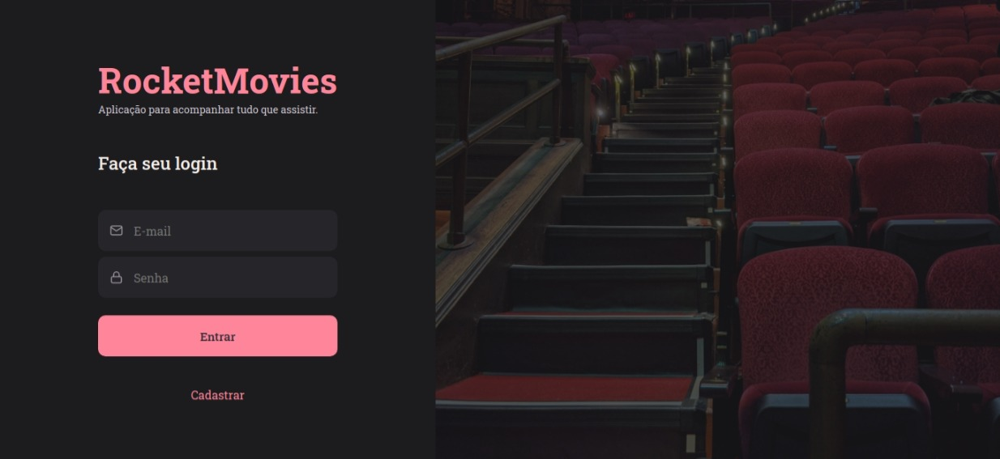

# RocketMovies Front-end

  

Este é um projeto front-end desenvolvido durante desafio o Stage 09 no Explorer da Rocketseat. E usamos as seguintes tecnologias:

## Stack utilizada

**Front-end:** ReactJS, Vite, Styled-Components, React-Router-DOM

**Ferramentas:** Navegador

## Aprendizados

Foi possível desenvolver e criar um projeto front-end completo. Capaz de trocar de páginas sem atualizar o projeto, seguindo o conceito SPA (Single Page Application).

Foi desafiador sair do conhecimento em front-end e ir para o desenvolvimento de um framework como ReactJS, como já tinha conhecimentos base de HTML, CSS e JavaScript, consegui desenvolver esta aplicação e sinto confiança para desenvolver outras.

## Funcionalidades

- Cadastrar Usuário
- Alterar Usuário

- Cadastrar Notas
- Mostrar Notas
- Pesquisar Notas
- Filtrar notas por nome
- Mostrar Tags

## Relacionados

Segue o projeto back-end desta aplicação:

[API Movies](https://github.com/HenricoAngolera/api_movies)

## Feedback

Se você tiver algum feedback, por favor nos deixe saber por meio de henrico.an@gmail.com
